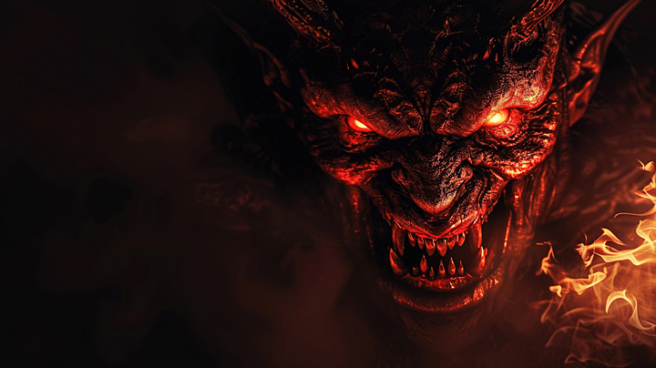
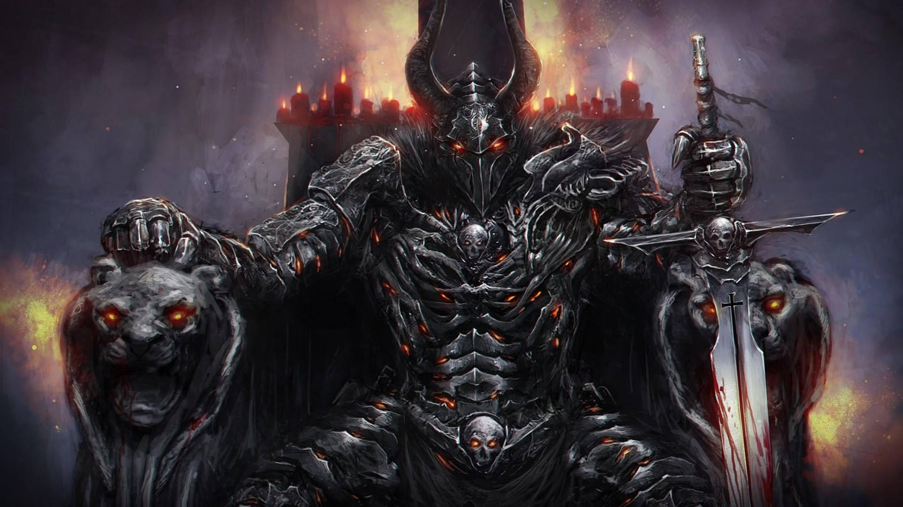

# 🔥 Satanic-Themed Website 🔥

## 🏴 Overview
This is a dark-themed website centered around Satanic and devil-inspired aesthetics. It features eerie visuals, gothic fonts, and an immersive, mysterious atmosphere. Whether you're exploring the occult, creating a horror-themed project, or just embracing the dark arts, this website serves as the perfect foundation.

## 🎨 Features
- ⚫ Dark UI with blood-red and black aesthetics
- 🔥 Sinister animations and eerie hover effects
- 📜 Gothic-style typography for immersive vibes
- 🎶 Optional creepy background music
- 🕯️ Dynamic lighting effects for a mystical touch

## 🔧 Technologies Used
- 🖥️ **Frontend**: HTML, CSS, JavaScript (Vanilla or Framework-based)
- 🎭 **Fonts & Icons**: Google Fonts (Gothic), FontAwesome for icons
- 🌑 **Theme**: Dark Mode by default, customizable color schemes
- 🎶 **Audio**: Optional ambient background sound

# 🔥 𝕷𝖊𝖌𝖎𝖔𝖓 𝖔𝖋 𝕯𝖆𝖗𝖐𝖓𝖊𝖘𝖘 🔥  

**"𝕿𝖍𝖊 𝖓𝖚𝖒𝖇𝖊𝖗 𝖔𝖋 𝖙𝖍𝖊 𝖇𝖊𝖆𝖘𝖙 𝖎𝖘 𝟞𝟞𝟞… 𝖆𝖓𝖉 𝖎𝖙 𝖑𝖎𝖛𝖊𝖘 𝖍𝖊𝖗𝖊."** 👁️‍🗨️  

## 🕷️ What Is This?  
A website designed to intrigue, haunt, and awaken curiosity about the unknown. Step into a realm where the devil whispers secrets, symbols hide meaning, and the abyss stares back at you.   

## 🔮 What Does the Devil Love?  
🔥 **The Number 666** – A mark of power and rebellion.  
💀 **Midnight Rituals** – The hour of shadows and whispers.  
🩸 **Deals & Contracts** – Be careful what you wish for…  
🎭 **Deception & Illusions** – Nothing is as it seems.  
🦇 **The Dark Arts** – Forbidden knowledge awaits.  

## 👁️ Features of This Sinister Realm  
- **Blood-Stained UI** – A deep crimson and black color palette.  
- **Occult Symbols & Animations** – Watch the sigils come to life.  
- **Eerie Soundscapes** – Echoes of the void (optional).  
- **Interactive Curses** – Click wisely… some links may trap you.  
- **Gothic Typography** – Because normal fonts are for mortals.  

## ⚙️ Tech Behind the Abyss  
- **Frontend**: HTML, CSS, JavaScript (or your chosen framework).  
- **Fonts & Icons**: Gothic typefaces, FontAwesome for dark symbols.  
- **Background Magic**: CSS animations, spooky JavaScript effects.  
